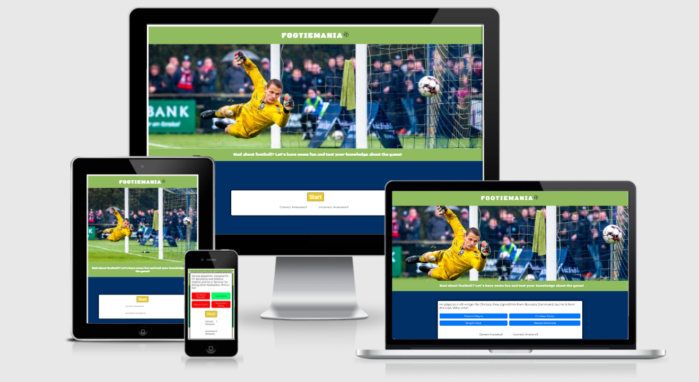
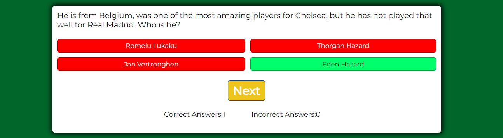
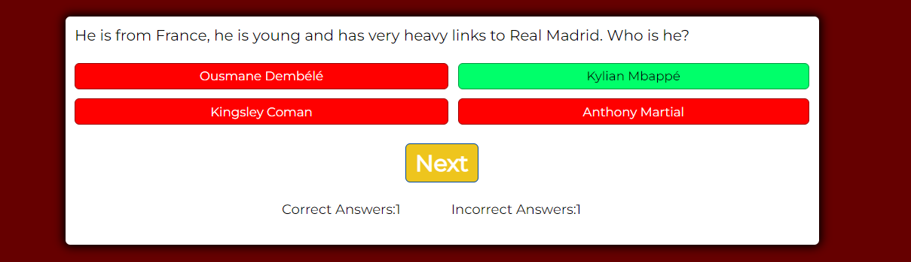

# FOOTIEMANIA

## Welcome to Footiemania, the online quiz for people who LOVE all about football, including the facts!



_Do you know that Pele scored more than 1200 goals in his career? Or which country won the first World Cup?_ Yes, it was Uruguay!

If facts like these make you smile, let’s play! Press the yellow start button and enjoy testing your own knowledge.

Footiemania is the perfect football quiz application for football enthusiasts of all ages who love everything about this sport, including the generally “boring stuff" like facts about the football players and their backgrounds, the teams, the premier league and various other competitions. But these facts are only boring if you’re not into football. If you are, whether you get excited about chasing the football on the pitch or watching the game from the comfort of your home, get ready and have some fun! You might even learn something new, you never know. ;-) 

---

## Showcase

- A deployed link to the website can be found [here.](https://psnaz.github.io/footiemania/) 
- The purpose of this quiz is to have fun and test the user's knowledge about the game.
- This one page quiz application is designed to be responsive and accessible on a range of devices, making it easy to navigate for the audience.

---

## Features

### Logo Area
- The top of the page includes a green logo area.


###  Landing Page Image
- Right below the logo area is a striking photograph of a goalkeeper letting a goal in.


### Tagline
- Below the hero image is a welcoming tagline that should entice the user to start playing this quiz.


### Game Area Displayed Before Start

- The bottom part of the screen is dedicated to the responsive part of the game area. It includes a yellow START button and below score count set to 0 for both, correct and incorrect answers.


### Question Area

#### Question Area Displayed Once START Button Displayed
- Once the start button's pressed, a white question area appears. It includes a quiz question and 4 interactive light blue buttons with a choice of answers.


#### Question Area - CORRECT ANSWER DISPLAYED
- When the user clicks one of the blue answer buttons and chooses the correct answer the answer buttons change colour: the correct answer button turns green, the rest of the answer buttons for wrong answers turn red. Also, the game area background colour turns green to indicate the success.
- At the same time, yellow button NEXT appears and the score in the correct answers increases by 1.



#### Question Area - WRONG ANSWER DISPLAYED
- When the user clicks one of the blue answer buttons and chooses a wrong answer the answer buttons change colour: the correct answer button turns green, the rest of the answer buttons for wrong answers turn red. Also, the game area background colour turns red to indicate that a wrong answer's been chosen.
- At the same time, yellow button NEXT appears and the score in the incorrect answers increases by 1.




### Next Button
- To be able to proceed to the next question the user has to press the NEXT yellow button. 
- When the NEXT button is pressed, the next question is displayed. 


### Score Area
- The score area is there to count the score that increases or decreases always by 1 depending if the user chooses a correct or incorrect answer.


### QUESTIONS
- There are currently 11 questions only stored in the js file of the quiz game.
- Potentially, hundreds of questions could be added to this game.

---

## User Experience (UX)

The target audience (end users) of this project are football enthusiasts of all ages, predominantly boys between 10-14 who _“live and breathe”_ football like my son. 

The end user is looking for a fun way to be entertained while testing and also expanding their knowledge about football.

The benefit of this project is fun and learning at the same time.
The score count feature can monitor the players’ improvement and/or can enable to enjoy a fun competitive game when socializing at home.

### User Stories

- As an end user I want to have some fun and learn something new at the same time.
- As an end user I want to get excited about testing my knowledge  
- As an end user I want to receive clear instructions to be able to understand what this quiz is about, how to play it and score points.
- As an end user I want to be able to read and understand the questions and answers easily.
- As an end user I want to be able to play this quiz game on a variety of devices, like a mobile phone or laptop, but also a desktop.

## Strategy 

### Steps Taken

- Project ideas jotted down in a notepad and a mind map created (pen & paper)
- Hero image searched for on pixabay.com and unspleash.com
- Various quizzes researched on Google and Youtube
- Quiz questions created in cooperation with my 10 year old football savvy son, Martin Snazle, who loves quizzing me on all football and keeps laughing at my lack of knowledge
- Application outlined, researched and written in Google docs

- Colour palette created in canva.com


- Mockup design created in canva.com and can be viewed [here.](https://www.canva.com/design/DAE435igaz4/8yfnZsaV_IAiWw6dCBzHgQ/edit?utm_content=DAE435igaz4&utm_campaign=designshare&utm_medium=link2&utm_source=sharebutton)

- Planning Session 1 with my mentor (Call 1)
- GitHub repository created [here](https://github.com/psnaz/footiemania)
- Project broke down into smaller tasks and To-Do List created in Google docs
- README file content outlined and written in Google docs
- Building work/ Coding started in Gitpod
- Project several times deleted and started again 
- Project Session 2 with my mentor (Call 2) - cancelled and rescheduled 2 or 3 times, in the end cancelled due to the lack of progress at the time and not rescheduled due to the tight deadline 
- Project finalized, tested
- Project submitted to the Code Institute for marking


## Technologies Used

### Languages Used
- HTML5
- CSS3
- JavaScript

### Frameworks, Libraries and Programs Used


- unsplash.com: Unsplash was used to find the hero image: image used taken by   
- Canva.com: Canva Color Palette Generator was used to create a color palette and Canva was used to create a mock-up design, and for resizing and editing images.
- Google Fonts: Google fonts were used to import the ‘Black Ops One’ and ‘Montserrat light 400’ fonts into the style.css files. 
- Git: Git was used for version control by utilizing the Gitpod terminal - to commit to Git and push to GitHub
- GitHub: Github is used to store the project's code after being pushed from Git.
- GoogleDev Tools used to see the element positioning and responsiveness, and view JavaScript console
- TinyPNG was used to compress the images


DELETE ALL BELOW


Welcome psnaz,

This is the Code Institute student template for Gitpod. We have preinstalled all of the tools you need to get started. It's perfectly ok to use this template as the basis for your project submissions.

You can safely delete this README.md file, or change it for your own project. Please do read it at least once, though! It contains some important information about Gitpod and the extensions we use. Some of this information has been updated since the video content was created. The last update to this file was: **September 1, 2021**

## Gitpod Reminders

To run a frontend (HTML, CSS, Javascript only) application in Gitpod, in the terminal, type:

`python3 -m http.server`

A blue button should appear to click: _Make Public_,

Another blue button should appear to click: _Open Browser_.

To run a backend Python file, type `python3 app.py`, if your Python file is named `app.py` of course.

A blue button should appear to click: _Make Public_,

Another blue button should appear to click: _Open Browser_.

In Gitpod you have superuser security privileges by default. Therefore you do not need to use the `sudo` (superuser do) command in the bash terminal in any of the lessons.

To log into the Heroku toolbelt CLI:

1. Log in to your Heroku account and go to *Account Settings* in the menu under your avatar.
2. Scroll down to the *API Key* and click *Reveal*
3. Copy the key
4. In Gitpod, from the terminal, run `heroku_config`
5. Paste in your API key when asked

You can now use the `heroku` CLI program - try running `heroku apps` to confirm it works. This API key is unique and private to you so do not share it. If you accidentally make it public then you can create a new one with _Regenerate API Key_.

------

## Release History

We continually tweak and adjust this template to help give you the best experience. Here is the version history:

**September 1 2021:** Remove `PGHOSTADDR` environment variable.

**July 19 2021:** Remove `font_fix` script now that the terminal font issue is fixed.

**July 2 2021:** Remove extensions that are not available in Open VSX.

**June 30 2021:** Combined the P4 and P5 templates into one file, added the uptime script. See the FAQ at the end of this file.

**June 10 2021:** Added: `font_fix` script and alias to fix the Terminal font issue

**May 10 2021:** Added `heroku_config` script to allow Heroku API key to be stored as an environment variable.

**April 7 2021:** Upgraded the template for VS Code instead of Theia.

**October 21 2020:** Versions of the HTMLHint, Prettier, Bootstrap4 CDN and Auto Close extensions updated. The Python extension needs to stay the same version for now.

**October 08 2020:** Additional large Gitpod files (`core.mongo*` and `core.python*`) are now hidden in the Explorer, and have been added to the `.gitignore` by default.

**September 22 2020:** Gitpod occasionally creates large `core.Microsoft` files. These are now hidden in the Explorer. A `.gitignore` file has been created to make sure these files will not be committed, along with other common files.

**April 16 2020:** The template now automatically installs MySQL instead of relying on the Gitpod MySQL image. The message about a Python linter not being installed has been dealt with, and the set-up files are now hidden in the Gitpod file explorer.

**April 13 2020:** Added the _Prettier_ code beautifier extension instead of the code formatter built-in to Gitpod.

**February 2020:** The initialisation files now _do not_ auto-delete. They will remain in your project. You can safely ignore them. They just make sure that your workspace is configured correctly each time you open it. It will also prevent the Gitpod configuration popup from appearing.

**December 2019:** Added Eventyret's Bootstrap 4 extension. Type `!bscdn` in a HTML file to add the Bootstrap boilerplate. Check out the <a href="https://github.com/Eventyret/vscode-bcdn" target="_blank">README.md file at the official repo</a> for more options.

------

## FAQ about the uptime script

**Why have you added this script?**

It will help us to calculate how many running workspaces there are at any one time, which greatly helps us with cost and capacity planning. It will help us decide on the future direction of our cloud-based IDE strategy.

**How will this affect me?**

For everyday usage of Gitpod, it doesn’t have any effect at all. The script only captures the following data:

- An ID that is randomly generated each time the workspace is started.
- The current date and time
- The workspace status of “started” or “running”, which is sent every 5 minutes.

It is not possible for us or anyone else to trace the random ID back to an individual, and no personal data is being captured. It will not slow down the workspace or affect your work.

**So….?**

We want to tell you this so that we are being completely transparent about the data we collect and what we do with it.

**Can I opt out?**

Yes, you can. Since no personally identifiable information is being captured, we'd appreciate it if you let the script run; however if you are unhappy with the idea, simply run the following commands from the terminal window after creating the workspace, and this will remove the uptime script:

```
pkill uptime.sh
rm .vscode/uptime.sh
```

**Anything more?**

Yes! We'd strongly encourage you to look at the source code of the `uptime.sh` file so that you know what it's doing. As future software developers, it will be great practice to see how these shell scripts work.

---

Happy coding!
